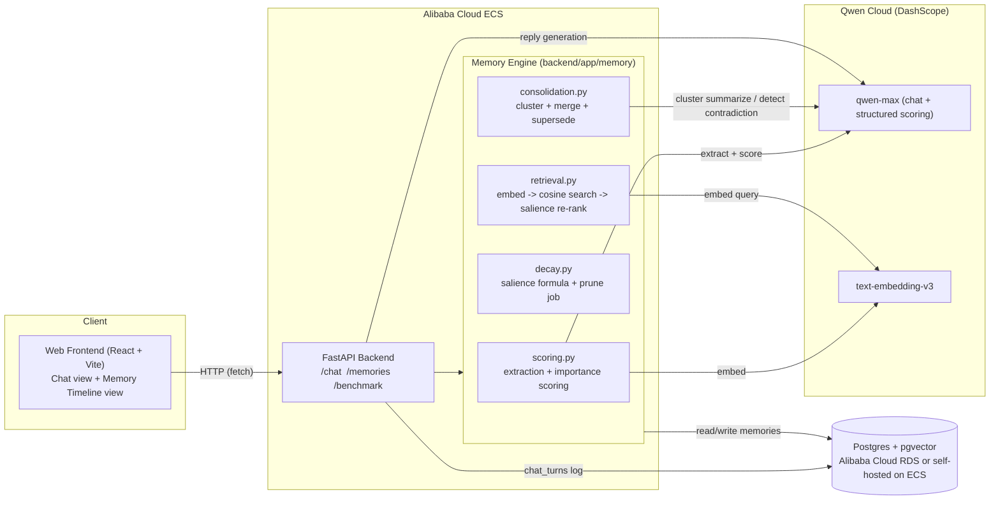

# Synapse Architecture

## System diagram



This matches CLAUDE.md section 2 exactly, rendered from the real module
structure in `backend/app/` rather than a stock image.

## Data flow: one chat turn

1. **Frontend** (`frontend/src/components/ChatView.jsx`) posts `{user_id, message}` to `POST /chat`.
2. **Retrieval** (`backend/app/memory/retrieval.py::retrieve_for_query`):
   - Embeds the query via Qwen `text-embedding-v3`.
   - Pulls the top-N most cosine-similar *active* memories for that user from Postgres/pgvector.
   - Re-ranks candidates by `similarity x current_salience` (not similarity alone).
   - Takes the top-K, bumps their `recall_count`/`last_recalled_at`, recomputes their salience (the "use it or lose it" reinforcement).
3. **Chat** (`backend/app/main.py::chat`): builds a system prompt injecting the recalled memories, calls Qwen `qwen-max` for the reply.
4. **Background write** (`backend/app/memory/scoring.py::extract_and_write_turn`, run as a FastAPI background task so it doesn't block the response):
   - Calls Qwen to extract discrete memory candidates from the turn.
   - Scores each candidate's importance via a structured Qwen call (`{"importance", "memory_type", "reasoning"}`).
   - Embeds and inserts each as a new `memories` row with `salience = importance_score` initially.
5. **Consolidation trigger**: every `CONSOLIDATION_TRIGGER_EVERY_N_WRITES` active memories, the background task also runs the "sleep pass" (`backend/app/memory/consolidation.py`):
   - Clusters similar episodic memories (agglomerative clustering over cosine distance) and asks Qwen to merge repeat-pattern clusters into one `consolidated` semantic memory, retiring the originals.
   - Compares active semantic/consolidated memories pairwise (gated by embedding similarity to stay cheap) and asks Qwen whether a newer one supersedes an older one -- if so, the old one is retired with `pruned_reason = 'superseded'`. This is the "timely forgetting of outdated information" the track brief asks for.
6. **Decay job** (`backend/app/memory/decay.py::run_decay_and_prune`) recomputes salience for every active memory using the formula below and prunes (soft-deletes) anything that falls below `PRUNE_SALIENCE_FLOOR`.

## The salience formula (CLAUDE.md section 3.3)

```
salience(t) = importance_score * recall_boost(recall_count) * exp(-lambda * hours_since_last_recall)
recall_boost(n) = 1 + log(1 + n)
lambda = ln(2) / half_life_hours     (half-life differs by memory_type, see backend/app/config.py)
```

- `episodic` memories (specific one-off details) have a short half-life (default 72h) -- they fade fast unless reinforced by being recalled again.
- `semantic` and `consolidated` memories (stable preferences, generalized patterns) have a long half-life (default 720h / 30 days).
- Recall reinforcement uses `log(1+n)` specifically so repeated recalls have diminishing returns -- no single memory can dominate the context window forever just because it was asked about once a lot early on.

All of these are `config.py` / env-var values, never hardcoded inline (CLAUDE.md section 9).

## Why this beats "store everything, retrieve top-k"

The naive baseline (`backend/benchmark/naive_agent.py`) uses the identical Qwen
chat and embedding models but has no importance scoring, no salience, no decay,
no consolidation, and no pruning -- it's the generic "vector DB as search
index" approach. `backend/benchmark/run_benchmark.py` runs both agents through
the same synthetic 44-day, 160+ turn conversation log
(`backend/benchmark/conversation_log.py`) and produces `backend/benchmark/output/benchmark_results.png`,
comparing active memory count, context tokens spent per query, and LLM-judged
recall accuracy -- especially on the two deliberate contradiction probes
(Berlin -> Lisbon, Python -> Rust), where the naive baseline has no mechanism
to stop surfacing the stale fact.
